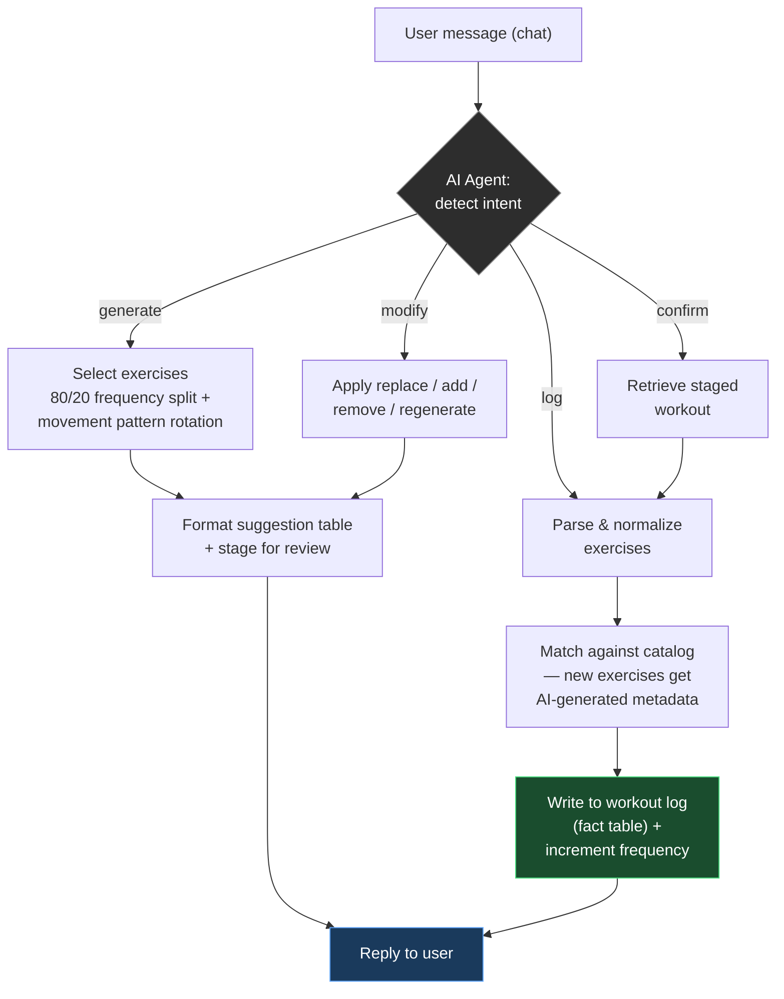

# Workout AI Agent

A chat-driven fitness tracker built on n8n. It logs workouts through natural conversation, generates tailored workout suggestions from training history, and maintains a self-growing exercise catalog — no manual data entry beyond describing what you did.

> **Snapshot notice:** this repo reflects the production workflow as of **August 2026**. It is a point-in-time export, not a live mirror — the running system may have evolved since. See [`DESIGN.md`](./DESIGN.md) for full technical detail.

Companion repo: analytics built on the data this agent produces → [workout-analysis](https://github.com/nlavrincikova/workout-analysis)

---

## What it does

Talk to it like a training log:
- *"Today I did 3 rounds of 12 squats and 10 pushups"* → logs the session, matches or creates catalog entries
- *"Suggest a lower body workout"* → generates a session from training history, balanced across movement patterns
- *"Replace squats with lunges"* / *"Add plank"* / *"Regenerate"* → adjusts the suggestion before you commit
- *"Confirm"* → writes the approved session to the log

## Architecture

**Design pattern:** the AI agent only *decides* — intent, exercise names, metadata. It never generates IDs or enforces uniqueness. All deduplication, ID assignment, and write ordering (catalog before log) is handled deterministically in code, not left to the LLM. Full rationale in `DESIGN.md` §1.3.

## Data model

Four tables, star-schema style:

| Table | Role |
|---|---|
| `exercise_list` | Dimension — master exercise catalog, AI-enriched metadata |
| `workout_type` | Dimension — session classification reference |
| `workout_exercise` | Fact — one row per exercise per logged session |
| `staged_workout` | Session state — holds a suggestion between chat turns until confirmed |

Full column-level spec in [`DESIGN.md`](./DESIGN.md).

## Stack

- **Orchestration:** n8n (self-hosted)
- **LLM:** OpenAI (agent reasoning, intent parsing, metadata generation)
- **Storage:** Google Sheets (Phase 1 — Notion migration planned, see `DESIGN.md` §3.2)
- **Frontend:** custom HTML/JS chat page served as a separate n8n workflow

## Repo contents

- `DESIGN.md` — full technical design: data model, node-by-node flow reference, known issues, migration plan
- `fitness_exercise_catalog_20260326.json` — main LOG/GENERATE/MODIFY/CONFIRM workflow export
- `workout_tracker_page.json` — chat frontend workflow
- `workout_tracker_get_staged_workout_api.json` — supporting API endpoint for session state

All webhook IDs and the production host are redacted from these exports. Endpoints are non-functional as published.
